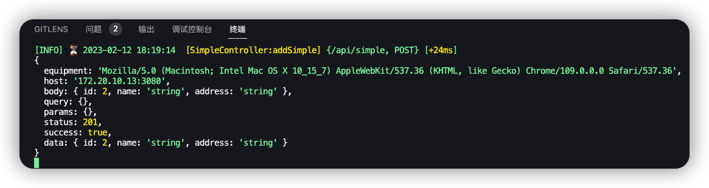

<p align="center">
  
</p>

- 🛴 使用 `pnpm` 进行依赖管理
- 📖 对 `http` and `程序` 错误进行捕获返回统一结构格式响应
- 🥽 对每次请求进行日志管理,美化输出到控制台 and 日志文件中
- 🪂 对业务模块进行统一集中自动导入并在 AppModule 中
- 🛵 集成 Swagger and knife4j API 文档
- 🛟 通过 `js-yaml` 统一管理项目环境配置

### 安装

```bash
npx pnpm install
```

### 运行

```bash
# development
npm run start

# watch mode
npm run start:dev

# production mode
npm run start:prod
```

#### 错误捕获、响应统一

```js
{
  "timestamp": "2023-02-12 17:55:55",
  "path": "/api/simple",
  "status": 201,
  "success": true,
  "data": {
    "id": 1,
    "name": "string",
    "address": "string"
  },
  "timeout": "+28ms"
}
```

#### 日志输出



#### 业务模块统一集中管理(自动 imports AppModule)

```js
// 抽离 App 配置
import { ConfigModule } from '@nestjs/config';
import * as ora from 'ora';
import { getYmlConfig } from 'src/utils/yml';
import { TypeOrmModule } from '@nestjs/typeorm';
import { DataSource } from 'typeorm';
// import * as CoreAllModule from '@/core';
import * as fs from 'fs';
import * as path from 'path';
// 获取core下的目录
const croePath = path.resolve(__dirname, '../../core');
const coreDris = fs.readdirSync(croePath);

// 动态导入core下的所有模块
export const getAllCoreModule = () => {
  const data = {};
  const result = [];
  for (const item of coreDris) {
    const isDir = fs.statSync(path.resolve(croePath, item)).isDirectory();
    if (isDir) {
      const module = require(`${croePath}/${item}/${item}.module`);
      Object.assign(data, module);
    }
  }
  Object.values(data).forEach((item) => {
    result.push(item);
  });
  return result;
};

export const getAppImports = () => [
  ConfigModule.forRoot({
    // 如果在多个文件中找到一个变量，则第一个优先
    // envFilePath: ['.env', `.${process.env.RUN_ENV == 'dev' ? 'dev' : 'pro'}.env`],
    isGlobal: true, // 是否全局
    ignoreEnvFile: true,
    load: [getYmlConfig], // 加载配置文件(注意: 不需要手动执行 getYmlConfig()会自动执行)
  }),
  TypeOrmModule.forRootAsync({
    useFactory: () => ({ ...getYmlConfig('DATABASE') }),
    async dataSourceFactory(options) {
      if (!options) throw new Error('传递无效选项');
      const spinner = ora();

      const success = await new DataSource(options);
      if (!success) throw spinner.fail('连接数据库失败');
      return success;
    },
  }),
];
```

### 集成 Swagger and knife4j API 文档

```js
// Description: 文档配置
import { SwaggerModule, DocumentBuilder } from '@nestjs/swagger';
import { knife4jSetup } from 'nestjs-knife4j';

export const knife4jConfig = (app) => {
  const options = new DocumentBuilder().setTitle('NestJs API Docs').setDescription('NestJs 的 API 文档').setVersion('1.0').build();
  const document = SwaggerModule.createDocument(app, options);
  SwaggerModule.setup('/api-doc', app, document);
  knife4jSetup(app, {
    urls: [
      {
        name: '🥽',
        url: `/api-json`,
        swaggerVersion: '1.0',
        location: `/api-json`,
      },
    ],
  });
};
```

#### 数据库操作

`ORM` 就是这样，把关系数据库的结构映射到对象上。而我们只要传入这些结构的`javaScript`对象，数据库就会自行对应存储数据

每个实体都必须要有一个主列

- 用`@PrimaryColumn()`来标记主列，需要给它手动分配值

- 用`@PrimaryGeneratedColumn()`来标记主列，该值将使用自动增量值自动生成

- 用`@PrimaryGeneratedColumn('uuid')`来标记主列，该值将使用`uuid`（通用唯一标识符）自动生成，`uuid`可以被认为是唯一的

作者：原野风殇
链接：https://juejin.cn/post/7184350230492479545
来源：稀土掘金
著作权归作者所有。商业转载请联系作者获得授权，非商业转载请注明出处。

在 entity 创建数据主体元信息 `src/core/simple/entities/simple.entity.ts`

```js
import { Entity, PrimaryGeneratedColumn, Column } from 'typeorm';
import { ApiProperty } from '@nestjs/swagger';
@Entity() // 🥽 注意
export class Simple {
  @ApiProperty({ description: 'id' })
  @PrimaryGeneratedColumn({
    type: 'int',
    comment: '主键',
  })
  id?: number;

  @ApiProperty({ description: 'name' })
  @Column({
    type: 'varchar',
    length: 255,
    comment: '名称',
  })
  name: string;

  @ApiProperty({ description: '所在地' })
  @Column({
    type: 'varchar',
    length: 255,
    comment: '所在地',
  })
  address: string;
}
```

在 `src/core/simple/simple.module.ts` 中 imports

```js
import { Module } from '@nestjs/common';
import { SimpleService } from './simple.service';
import { SimpleController } from './simple.controller';
import { TypeOrmModule } from '@nestjs/typeorm';
import { Simple } from './entities/simple.entity';

@Module({
  imports: [TypeOrmModule.forFeature([Simple])], // 导入
  controllers: [SimpleController],
  providers: [SimpleService],
})
export class SimpleModule {}
```

在 `src/core/simple/simple.service.ts` 注入

```js
import { Injectable, NotFoundException } from '@nestjs/common';
import { CreateSimpleDto } from './dto/create-simple.dto';
import { Repository } from 'typeorm';
import { InjectRepository } from '@nestjs/typeorm';
import { Simple } from './entities/simple.entity';
// import { UpdateSimpleDto } from './dto/update-simple.dto';

@Injectable()
export class SimpleService {
  // 方式一
  constructor(@InjectRepository(Simple) private readonly userRepositroy: Repository<Simple>) {}
  // private readonly userRepositroy: Repository<Simple>; // 方式二

  /*
   * 新增
   * @param {CreateSimpleDto} createSimpleDto
   * @returns {Promise<Simple>}
   */
  addSimple(body: Simple): Promise<Simple> {
    console.log(this.userRepositroy);

    return this.userRepositroy.save(body);
  }
}
```

## License

Nest is [MIT licensed](LICENSE).

### Typeorm-model-generator

-h IP 地址
-d 数据库名字
-p 端口
-u 用户名
-x 密码
-e 数据库类型
-o entities 表示输出到指定的文件夹
-noConfig true 表示不生成 ormconfig.json 和 tsconfig.json 文件
-ce pascal 表示将类名转换首字母是大写的驼峰命名
-cp camel 表示将数据库中的字段比如 create_at 转换为 createAt
-a 表示会继承一个 BaseEntity 的类,根据自己需求加

```js
npx rimraf ./src/entities && npx typeorm-model-generator -h localhost -d nestjs -p 3306 -u root -x 123456 -e mysql --ce pascal --cp camel -o src/entities --noConfig true
```

动态生成表结构时需要重新生产实体类

```js
import { execSync } from 'child_process';

execSync('npm run gen:entity');
```
